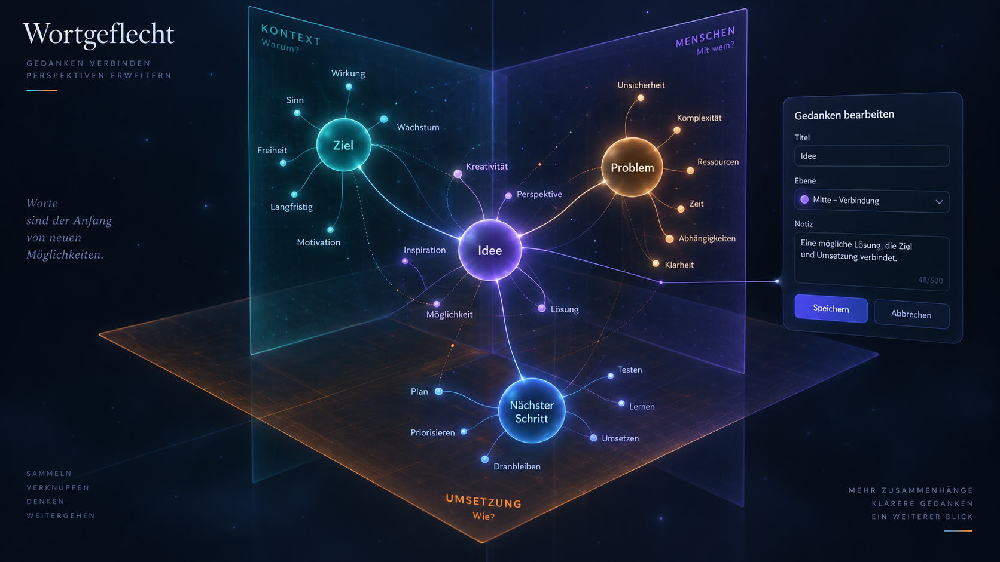
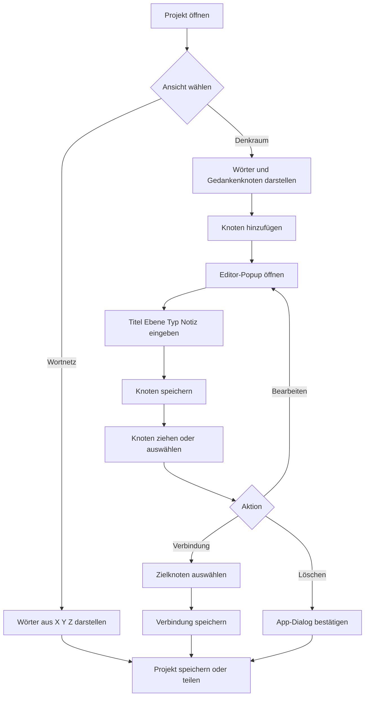
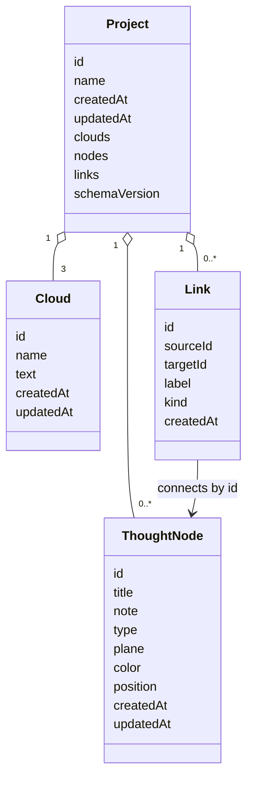

# Projektausbau: Wortgeflecht als räumlicher Denkraum

Wortgeflecht begann als 3D-Erweiterung einer Mindmap: Drei Texte erzeugen heute automatisch Wortknoten auf den Ebenen XY, YZ und XZ. Der nächste Ausbau ergänzt diese automatische Wortvernetzung um frei definierbare Gedankenknoten.

Die Visualisierung ist ein Funktionskonzept. Sie zeigt die gewünschte Richtung, ist aber noch kein fertiges UI-Layout.

## Zielbild

Wortgeflecht verbindet zwei Arten von Informationen in einem gemeinsamen 3D-Raum:

- **Wortknoten** entstehen automatisch aus den drei Eingabefeldern.
- **Gedankenknoten** werden von der Nutzerin oder dem Nutzer bewusst angelegt.
- **Verbindungen** machen Beziehungen zwischen Gedanken und Wörtern sichtbar.
- **Ebenen** geben jedem Knoten einen räumlichen Kontext.
- **Projekte** speichern Wortwolken, Gedankenknoten, Verbindungen und Positionen gemeinsam.

Damit bleibt die aktuelle Wortwolke schnell und niedrigschwellig, kann aber zu einer persönlichen Mindmap mit räumlicher Struktur wachsen.

## Vorgeschlagene Funktionen

### Gedankenknoten anlegen

Ein Button `Knoten hinzufügen` öffnet ein eigenes UI-Popup. Ein Gedankenknoten erhält mindestens:

- Titel
- Ebene: X, Y, Z oder Mitte/Verbindung
- Farbe oder Knotentyp
- optionale Notiz

Der Knoten wird zunächst nahe dem Ursprung oder beim aktuell ausgewählten Knoten platziert. Der Titel bleibt direkt am Knoten sichtbar.

### Knoten bearbeiten

Ein Klick oder Doppelklick öffnet den Editor. Dort können Titel, Notiz, Ebene, Farbe und Typ geändert werden. `Escape` schließt den Editor ohne Änderung; `Speichern` übernimmt die Änderungen.

### Knoten bewegen und löschen

Gedankenknoten verhalten sich beim Ziehen wie die vorhandenen Wortknoten. Ein Kontextmenü oder ein kleines Knotenmenü bietet `Bearbeiten`, `Duplizieren` und `Löschen`. Vor dem Löschen erscheint ein eigenes App-Dialogfenster mit Rückfrage.

### Verbindungen anlegen

Ein Verbindungsmodus erlaubt, von einem Knoten zu einem anderen zu ziehen. Verbindungen können zwischen folgenden Elementen entstehen:

- Gedankenknoten und Gedankenknoten
- Gedankenknoten und Wortknoten
- Wortknoten und Wortknoten, falls eine manuelle Beziehung zusätzlich zur automatischen Wortgleichheit gewünscht ist

Optional kann eine Verbindung einen kurzen Titel wie `führt zu`, `braucht`, `verursacht` oder `ähnlich` erhalten.

### Räumliche Ebenen

Die drei vorhandenen Ebenen bleiben erhalten. Gedankenknoten können einer Ebene zugeordnet oder als `Mitte/Verbindung` zwischen mehreren Ebenen platziert werden. Ein Ebenenfilter kann später alle Knoten einer Ebene hervorheben oder ausblenden.

### Denkraum- und Wortnetz-Ansicht

Zwei Ansichten können dieselben Daten unterschiedlich gewichten:

- **Wortnetz**: automatische Wörter und gemeinsame Begriffe stehen im Vordergrund.
- **Denkraum**: Gedankenknoten, Notizen und manuelle Verbindungen stehen im Vordergrund.

Die Daten bleiben identisch; nur Sichtbarkeit, Größen und Beschriftungen ändern sich.

## Interaktionsablauf

## Datenmodell

Das vorhandene Projektmodell wird um eigene Knoten und Verbindungen erweitert. Wortwolken bleiben vollständig eingebettet, damit ein Projekt auf einem anderen Gerät ohne lokale Vorbedingungen geöffnet werden kann.

Automatisch erzeugte Wortknoten müssen nicht dauerhaft als vollständige Projektdaten gespeichert werden. Sie können aus den drei Cloud-Texten rekonstruiert werden. Gespeichert werden müssen jedoch alle manuell angelegten Knoten, Verbindungen und deren Positionen.

## Was technisch noch zu tun ist

### 1. Daten- und Speicherverträge

- Projektschema auf `schemaVersion: 2` erweitern.
- `nodes` und `links` in `createProject()` und beim Laden normalisieren.
- IDs, Zeitstempel und ungültige Verweise validieren.
- Migration für bereits gespeicherte Projekte ohne `nodes` und `links` ergänzen.
- Import und Export um Gedankenknoten und Verbindungen erweitern.

### 2. Rendern und Geometrie

- Eigenes Rendering für Gedankenknoten ergänzen.
- Größere Karten oder Kugeln von kleinen Wortknoten unterscheiden.
- Beschriftungen und Notizen über das vorhandene CSS2D-Rendering anzeigen.
- Verbindungslinien mit Pfeilrichtung, Farbe und optionalem Label zeichnen.
- Positionen beim Ziehen dauerhaft im Projektzustand halten.
- Kamera-Fitting um manuelle Knoten erweitern.

### 3. Interaktion

- `Knoten hinzufügen` und den Editor als Template definieren.
- Auswahlzustand für Knoten und Verbindungen ergänzen.
- Dragging für Gedankenknoten an die bestehende Interaktion anbinden.
- Verbindungsmodus mit sichtbarem Start- und Zielzustand bauen.
- Kontextmenü mit Bearbeiten, Duplizieren und Löschen ergänzen.
- Rückfragen ausschließlich über die vorhandenen App-Dialoge anzeigen.

### 4. Benutzeroberfläche

- Denkraum-/Wortnetz-Schalter ergänzen.
- Ebenen- und Typfilter ergänzen.
- Knotenmenü responsive für Desktop und Mobil gestalten.
- Notiz- und Titeländerungen mit sichtbarer Erfolgsmeldung bestätigen.
- Tastaturbedienung für Auswahl, Löschen, Escape und Verbindungsmodus sicherstellen.

### 5. Teilen und Offline

- Gedankenknoten und Verbindungen in die Share-Payload aufnehmen.
- URL-Größe vor dem Teilen messen und bei Überschreitung einen Export anbieten.
- Share-Payload versionieren und fremde oder beschädigte Daten ablehnen.
- Service-Worker-App-Shell um neue Module und Templates erweitern.
- PWA-Cacheversion bei jeder Änderung an der App-Shell erhöhen.

### 6. Tests

- Unit-Tests für Normalisierung, Migration, IDs und Verbindungsvalidierung ergänzen.
- DOM-Tests für Editor, Knotenmenü und Bestätigungsdialoge ergänzen.
- Browser-Test: Knoten anlegen, verschieben, bearbeiten, verbinden, löschen und neu laden.
- Browser-Test: Projekt mit Gedankenknoten speichern und auf einer leeren lokalen Datenbank laden.
- Browser-Test: Share-URL mit Knoten und Verbindungen öffnen.
- Browser-Test: Offline-Aufruf mit den neuen Modulen und Templates.
- Screenshots oder Geometrieassertions für ausgewählte Knoten und Verbindungslinien ergänzen.

## Empfohlene Reihenfolge

1. Datenmodell, Migration und Speicher-Tests
2. Gedankenknoten rendern und verschieben
3. Editor-Popup für Anlegen und Bearbeiten
4. Löschen, Duplizieren und Rückfragen
5. Manuelle Verbindungen
6. Denkraum-/Wortnetz-Ansicht und Filter
7. Projekt-Import/Export und Teilen erweitern
8. Offline- und Browser-Regressionstests

Der erste nutzbare Meilenstein ist erreicht, sobald ein Gedankenknoten angelegt, benannt, verschoben, gespeichert, geladen und gelöscht werden kann. Verbindungen und die zweite Ansicht können darauf aufbauen.
